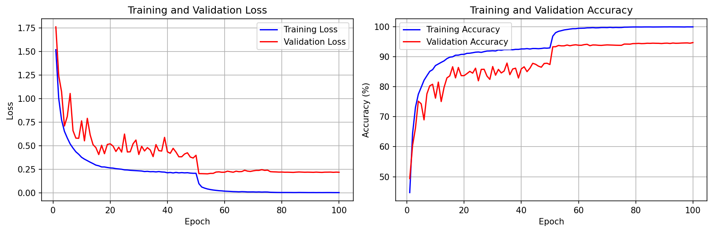
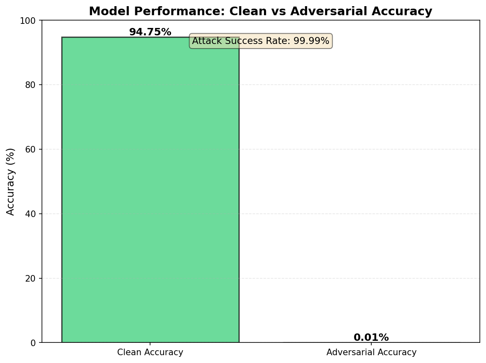
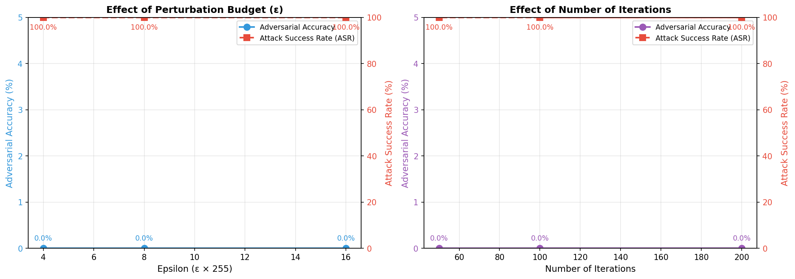
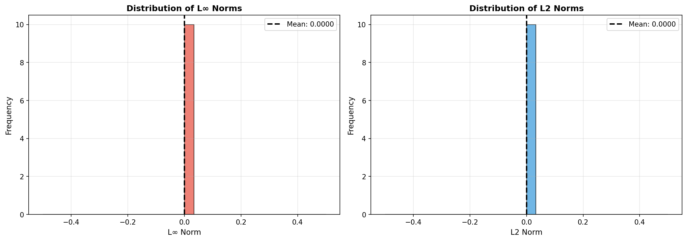
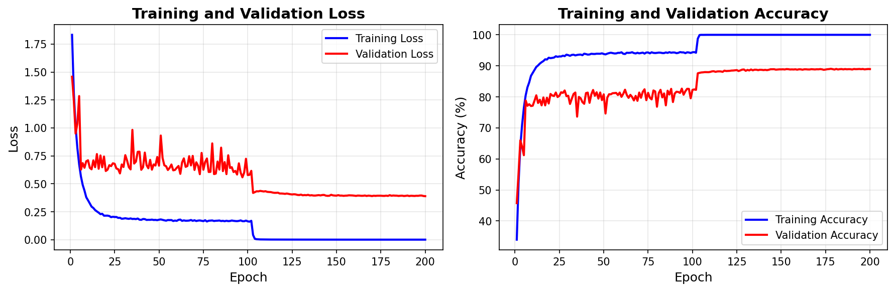
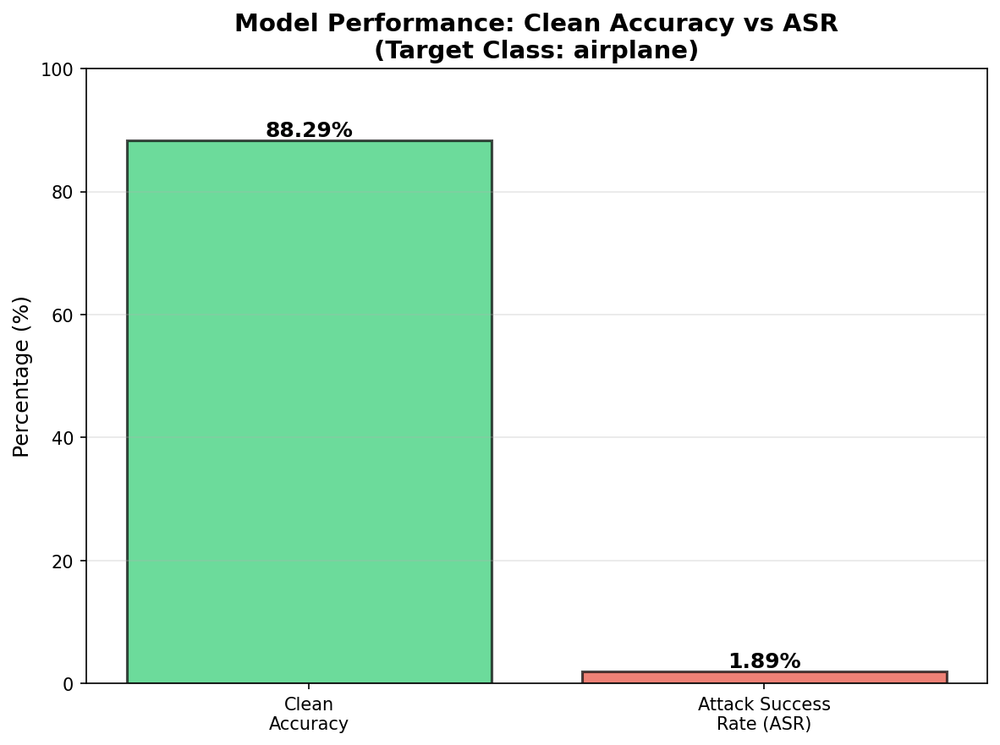
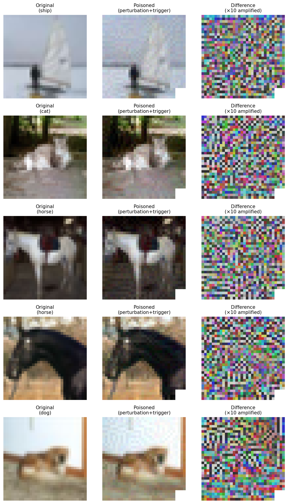
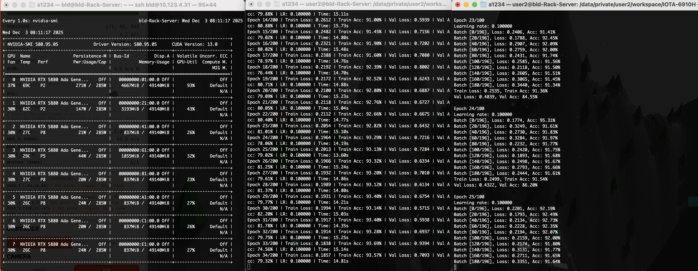

# IOTA6910H Assignment: Adversarial Attacks and Backdoor Attacks

This repository contains two parts of the assignment focusing on adversarial robustness and backdoor attacks in deep learning.

## 📋 Project Overview

This assignment consists of two independent parts:

- **Part 1**: Adversarial Example Generation using Auto-PGD
- **Part 2**: Clean-Label Backdoor Attack using Feature-Collision method

## 📁 Project Structure

```
.
├── README.md              # This file
├── part1/                 # Part 1: Adversarial Example Generation
│   ├── README.md          # Part 1 detailed instructions
│   ├── train.py           # Model training script
│   ├── evaluate.py        # Adversarial attack evaluation
│   ├── visualize.py       # Visualization script
│   └── ...
└── part2/                 # Part 2: Clean-Label Backdoor Attack
    ├── README.md          # Part 2 detailed instructions
    ├── generate_poison.py # Poison generation script
    ├── train.py           # Training script
    └── ...
```

## 🚀 Quick Navigation

### [Part 1: Adversarial Example Generation (Auto-PGD)](./part1/README.md)

Train and evaluate ResNet-18 model's robustness against Auto-PGD attacks on CIFAR-10 dataset.

**Key Features:**
- Train/fine-tune ResNet-18 on CIFAR-10
- Generate adversarial examples using Auto-PGD (ℓ∞, ε=8/255)
- Evaluate clean vs. adversarial accuracy
- Visualize adversarial examples and perturbations

**[→ Go to Part 1 README](./part1/README.md)**

---

### [Part 2: Clean-Label Backdoor Attack](./part2/README.md)

Implement and evaluate clean-label backdoor attacks using Feature-Collision method.

**Key Features:**
- Generate poisoned samples via feature-collision
- Train model on poisoned dataset
- Evaluate attack success rate (ASR) and clean accuracy
- Visualize poisoned samples and triggered inputs

**[→ Go to Part 2 README](./part2/README.md)**

---

## 📝 General Requirements

### Environment Setup

**Hardware**: This project was developed and tested on a server with 8× NVIDIA RTX 5880 Ada GPUs. For detailed hardware specifications, see [gpu.md](./gpu.md).

Both parts require:
- Python 3.7+
- PyTorch
- torchvision
- Other dependencies (see each part's README for details)

### Quick Installation

Each part has its own installation script. Navigate to the respective directory and follow the instructions in the README.

## 📊 Key Results

### Part 1: Adversarial Example Generation (Auto-PGD)

**Model Performance:**
- **Clean Accuracy**: 94.75%
- **Adversarial Accuracy**: 0.01% (under Auto-PGD attack)
- **Attack Success Rate (ASR)**: 99.99%
- **Attack Parameters**: ℓ∞ norm, ε = 8/255, ~100 iterations

The results demonstrate that while the ResNet-18 model achieves high accuracy on clean CIFAR-10 test samples, it is highly vulnerable to adversarial attacks. The Auto-PGD attack successfully fools the model in 99.99% of cases, reducing accuracy from 94.75% to nearly 0%.

**Training Progress:**


**Performance Comparison:**


**Parameter Sensitivity Analysis:**
The analysis shows that both perturbation budget (ε) and number of iterations significantly affect attack effectiveness. Larger ε values and more iterations generally lead to higher attack success rates.



**Perturbation Statistics:**


**Experiment Execution Screenshot:**


---

### Part 2: Clean-Label Backdoor Attack (Feature-Collision)

**Attack Performance:**
- **Clean Accuracy**: 88.29% (maintained high accuracy on clean test data)
- **Attack Success Rate (ASR)**: 1.89% (170 out of 9,000 non-target samples misclassified as target class)
- **Target Class**: Class 0 (airplane)
- **Poison Ratio**: 1.5% (75 poisoned samples out of 50,000 training samples)
- **Trigger**: 4×4 white patch at bottom-right corner (pixels [28:32, 28:32])

The clean-label backdoor attack demonstrates that even with a small poison ratio (1.5%), the model can be compromised while maintaining high clean accuracy. The attack successfully causes some non-target samples to be misclassified as the target class when the trigger is present.

**Training Progress:**


**Performance Comparison:**


**Perturbation Visualization:**
The visualization shows how the feature-collision method creates subtle perturbations that push samples away from their original class representation.



**Experiment Execution Screenshot:**


---

## 🎯 Conclusions

### Part 1: Adversarial Robustness

1. **High Vulnerability**: The ResNet-18 model, despite achieving 94.75% clean accuracy, is extremely vulnerable to adversarial attacks. The Auto-PGD attack reduces accuracy to near zero (0.01%), demonstrating the critical need for adversarial training and robust defenses.

2. **Parameter Impact**: 
   - **Perturbation Budget (ε)**: Larger ε values significantly increase attack effectiveness, as they allow for more substantial perturbations.
   - **Iterations**: More iterations improve attack success rate, as the iterative optimization process can find stronger adversarial examples.

3. **Practical Implications**: These results highlight that high clean accuracy does not guarantee robustness. Models deployed in security-critical applications must be evaluated against adversarial attacks and potentially trained with adversarial training techniques.

### Part 2: Clean-Label Backdoor Attacks

1. **Stealthy Attack**: The clean-label backdoor attack successfully compromises the model while maintaining 88.29% clean accuracy, making it difficult to detect through standard accuracy metrics alone.

2. **Low Poison Ratio Effectiveness**: With only 1.5% poisoned samples (75 out of 50,000), the attack achieves a 1.89% ASR. While this may seem low, it demonstrates the feasibility of backdoor attacks with minimal data poisoning, especially in scenarios where even a small percentage of misclassifications could be exploited.

3. **Feature-Collision Mechanism**: The Feature-Collision method works by creating adversarial perturbations that push samples away from their original class representation, facilitating collision with the target class in the model's feature space. This approach is particularly effective because it maintains the original labels, making poisoned samples appear legitimate.

4. **Defense Challenges**: The attack's success despite maintaining high clean accuracy highlights the challenge of detecting backdoor attacks. Defenders must look beyond accuracy metrics and consider specialized detection methods for backdoor attacks.

---

## 📄 Submission

Each part should include:
- **README.md**: Detailed reproduction instructions
- **Code**: Runnable scripts to reproduce all results
- **Report**: PDF containing results, visualizations, and analysis

## 📚 References

### Part 1
- Auto-PGD Paper: [Reliable Evaluation of Adversarial Robustness with an Ensemble of Diverse Parameter-free Attacks](https://arxiv.org/pdf/2003.01690)
- AutoAttack Library: [GitHub Repository](https://github.com/fra31/auto-attack)

### Part 2
- Feature-Collision Paper: [Clean-Label Backdoor Attacks](https://openreview.net/pdf?id=HJg6e2CcK7)

---

**Note**: For detailed instructions, dependencies, and usage, please refer to each part's README file.

